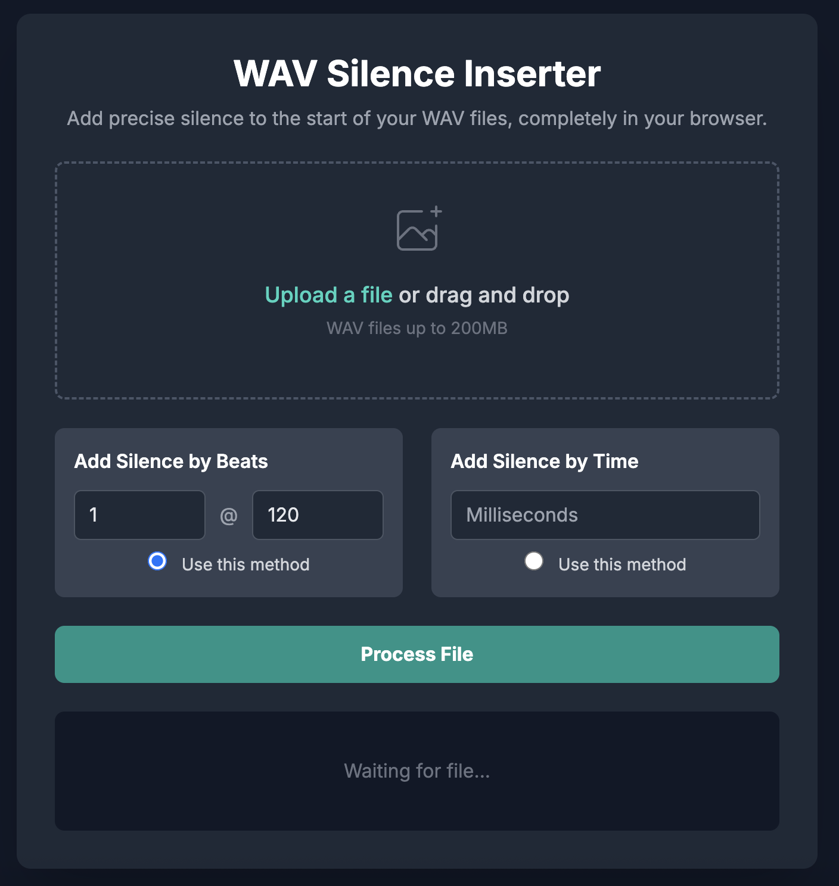

# WAV Silence Inserter

A lightweight, browser-based tool to add precise silence to the start of WAV files which is useful for DJs, music producers, and Ableton Live users who want to avoid clipped intros on streaming platforms or preserve arrangement timing without modifying the DAW project.

Runs **entirely in your browser**, with **no installation, no external dependencies, and no file uploads**. All processing is done locally, cross-platform, and works offline once loaded.

---

## Why This Exists

Some DAWs (including Ableton Live) don’t have an export option to prepend silence to a render.  
Common issues this causes:
- The first transient or beat gets clipped on platforms like SoundCloud or Spotify.
- DJ software (e.g., Rekordbox) fails to quantize correctly when a track starts exactly at `0:00`.
- Inserting silence inside the DAW messes up bar numbering, automation timing, LFO sync, and effect timing.

This tool solves it **after export** — without touching your arrangement or plugins.

Inspired by [darkmarthur’s StartOffseter](https://github.com/darkmarthur/StartOffseter), but re-implemented for the browser.

---

## Features

- **Add silence by beats** Enter the number of beats and BPM — the tool calculates the exact silence length.

- **Add silence by milliseconds** Specify a fixed duration in milliseconds for more direct control.

- **Preserves audio quality** Bit depth, sample rate, and channel count remain identical to the original file.  
  No re-encoding — just pure byte-level manipulation.

- **Metadata preservation** All non-audio chunks (BWF metadata, cue markers, iXML, etc.) are kept exactly as in the source.

- **Cross-platform** Works on Mac, Windows, Linux — any device with a modern browser.

- **Offline capable** Once loaded, it can run with no internet connection.

---

## How to Use

1. Visit the hosted app:  
   **[Live Demo on GitHub Pages](https://<your-username>.github.io/<repo-name>/)**

2. Drag and drop a `.wav` file, or use the file selector.

3. Choose **Beats @ BPM** or **Milliseconds** mode.

4. Click **Process File**.

5. Download the processed WAV with silence prepended.

---

## Example Use Cases

- **Ableton Live exports**: Add 1–2 beats of silence without shifting your project’s arrangement.
- **DJ prep**: Avoid Rekordbox beat grid mismatch on intro transients.
- **Streaming platforms**: Prevent clipped starts on SoundCloud, Spotify, car players, etc.

---

## Limitations (Compared to Original StartOffseter)

This browser version focuses on transparency and portability.  
It **does not** yet include:

- **WAV HEX fixing for Pioneer CDJs** StartOffseter rewrites the `fmt` chunk to strict PCM 24-bit LE and forces a fixed chunk order (`RIFF → fmt → metadata → data`).  
  This tool preserves the original file header — which is fine for most workflows, but may not fix `E-8305` errors on some Pioneer CDJs.

- **Forced 24-bit output option** StartOffseter always outputs `pcm_s24le`. This tool keeps the original format (e.g., float32, 16-bit, etc.).

- **Chunk reordering** Chunks are written back in the same order as parsed; some strict devices expect `fmt ` first.

- **Auto-rename with BPM/key/metadata** This tool appends `_offsetX` to the filename but does not parse or embed BPM/key info.

---

## Planned / Possible Future Features

Since this is open-source, contributors are welcome to add:

- [ ] Compatibility mode for Pioneer CDJs (strict header rewrite)
- [ ] Forced PCM 24-bit output option
- [ ] Optional chunk reordering for picky hardware
- [ ] Auto-renaming with BPM, key, sample rate
- [ ] Batch processing of multiple files
- [ ] PWA installable version for offline desktop use

---

## Technical Notes

- **Formats supported**: PCM integer (format code `1`) and IEEE float (format code `3`).
- **Silence generation**: Creates zero-filled samples matching the file’s bit depth and channel count.
- **Metadata handling**: All non-`data` chunks are copied byte-for-byte.

---

### Disclaimer
This tool processes files entirely on your device. No audio data is uploaded or stored remotely.  
Always keep a backup of your originals before processing.